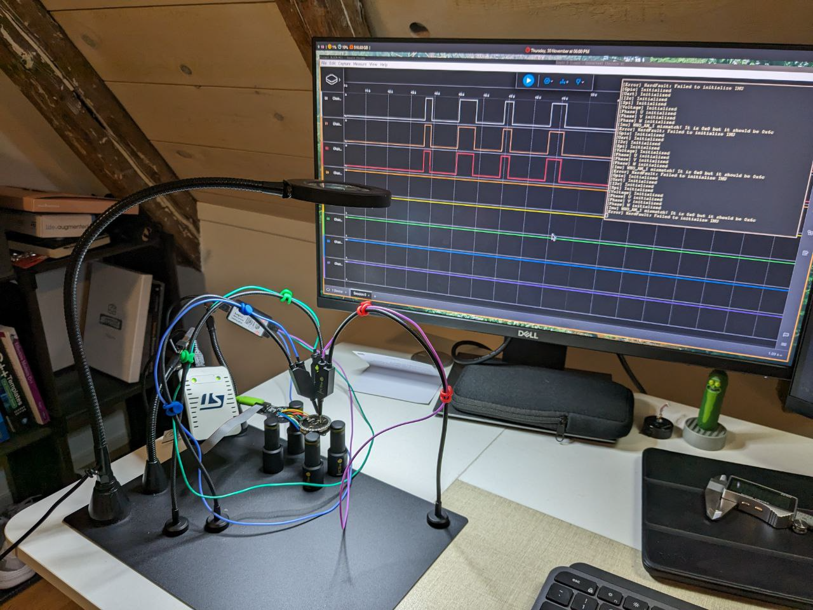
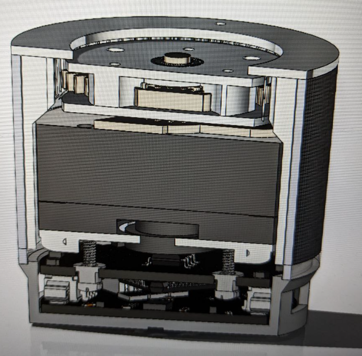
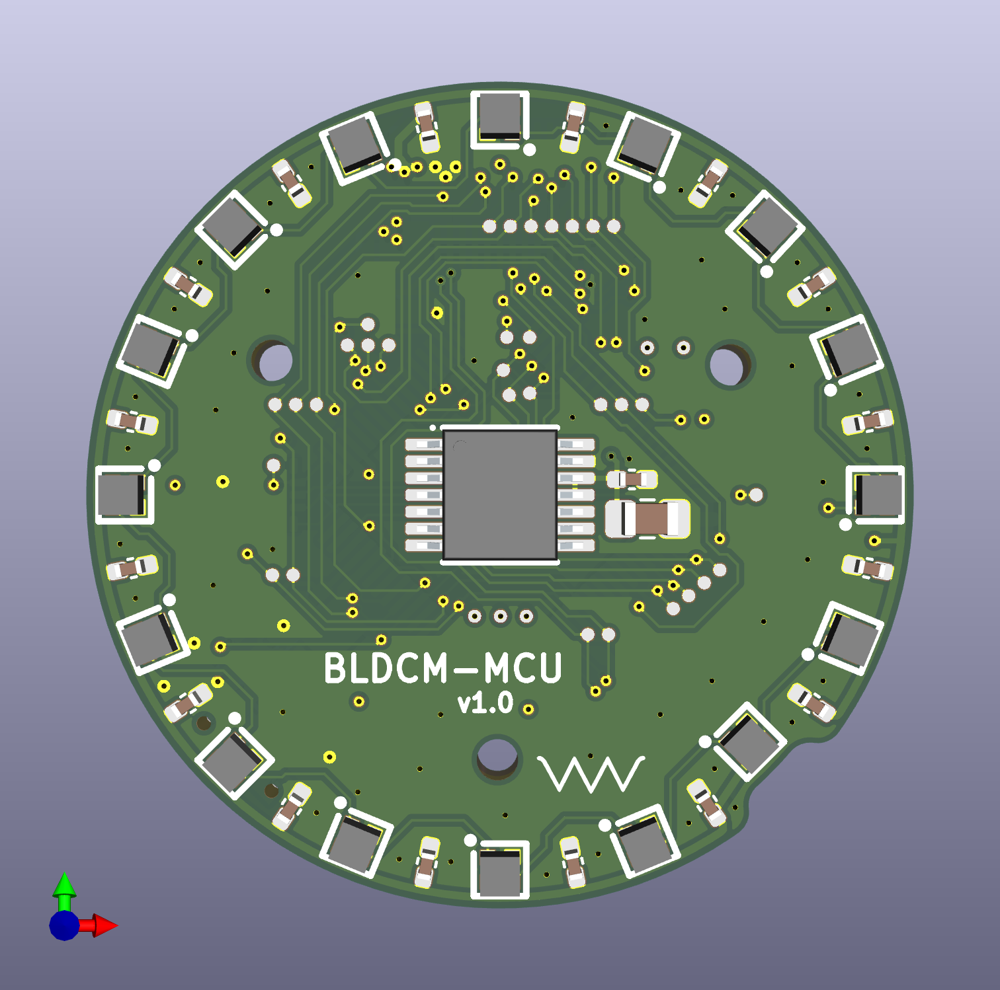
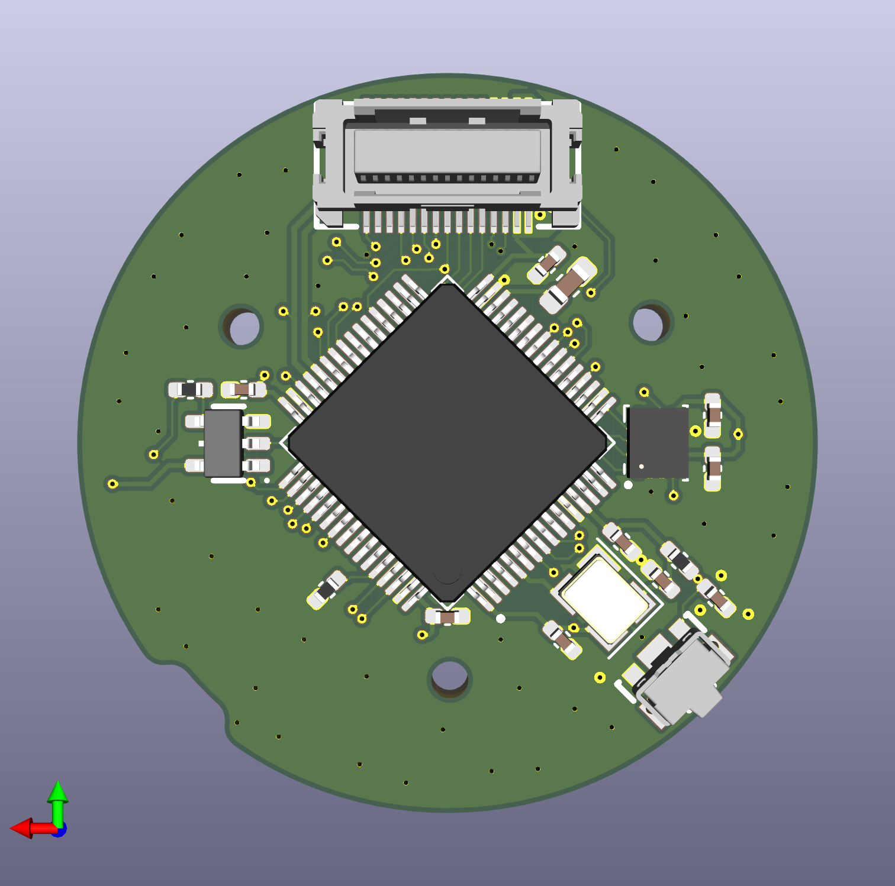
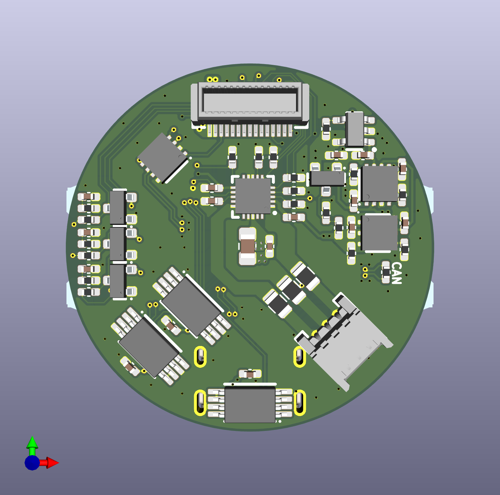
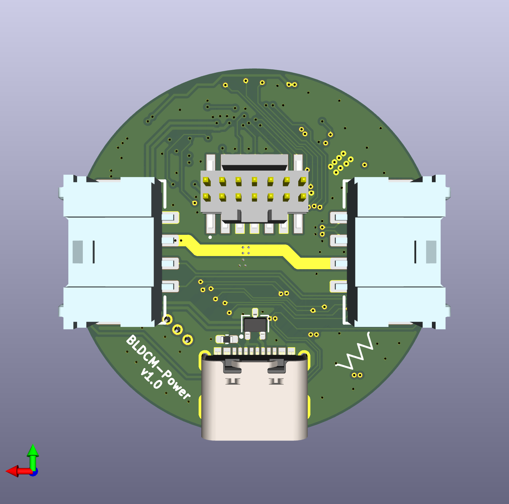

# BLDC Motor Controller

> [!NOTE]
> This project is currently in active development. Features and documentation are subject to change.

## Table of Contents
- [Project Overview](#project-overview)
- [Electronics](#electronics)
  - [MCU PCB (Top Board)](#mcu-pcb-top-board)
  - [Power PCB (Bottom Board)](#power-pcb-bottom-board)
- [Results](#results)

---

## Project Overview

This project aims to develop a **high-precision Brushless DC (BLDC) motor controller** from scratch, covering both hardware and firmware aspects. The controller is designed for advanced motor control applications, leveraging a powerful STM32 microcontroller, a dedicated motor driver IC, and comprehensive sensing capabilities for precise operation and rotor position estimation.

The core of the system is a custom two-board stack: an MCU board housing the main control logic and a power board managing motor drive and sensing. The two boards connect through a Molex board-to-board stack connector, keeping the whole assembly compact enough to sit directly behind the motor.

  
  &nbsp;&nbsp;
  

---

## Electronics

The electronics consist of two interconnected custom-designed Printed Circuit Boards (PCBs), designed using **KiCad**. Both boards are **4-layer, circular designs** sized to fit inside the motor housing, and stack together through a **Molex board-to-board connector** that carries power, control signals, and communication lines between them.

### MCU PCB (Top Board)

The top PCB is the brain of the controller. It runs the control loop, reads all of the position/motion sensors, and exposes the debug and status interfaces a developer needs while bringing the system up.

  
  &nbsp;&nbsp;
  

**How it works:**
- The **STM32F4 microcontroller** sits at the center of the board and runs the motor control algorithm (trapezoidal or FOC) in a fast timer-driven loop, reading sensor data and updating the PWM duty cycles sent down to the power board on every cycle.
- The **AS5048A** magnetic angle encoder reads the rotor's absolute position with 14-bit resolution off a magnet mounted on the motor shaft. This gives the controller true rotor position for commutation, rather than relying on back-EMF sensing, which matters a lot at low speed and standstill.
- The **ISM330DHCX IMU** adds acceleration and angular velocity data from the board itself, which is useful for detecting external motion or vibration and for any application where the motor's own orientation/movement (not just the rotor's) needs to be tracked.
- An **SK6805 RGB LED ring** wraps around the board's edge and is driven per-LED to show system status (idle, running, fault, etc.) at a glance without needing a debugger attached.
- A **reset button** is broken out on the edge for quick resets during bring-up and testing.
- The top-side connector routes down to the power board through the Molex stack connector, carrying the PWM/gate signals, sensor feedback, and shared power rails between the two boards.

### Power PCB (Bottom Board)

The bottom PCB handles everything high-current: driving the motor phases, sensing voltage and current, and providing the external connectivity for power and communication.

  
  &nbsp;&nbsp;
  

**How it works:**
- The **TMC6300** is a fully integrated 3-phase gate driver/MOSFET bridge. It takes the PWM commutation signals from the MCU board and switches the three motor phases directly — there's no separate discrete MOSFET stage, which keeps the board small enough to fit the round form factor.
- Three **INA240** current sense amplifiers measure the current on each motor phase in real time. This phase current feedback is what the FOC algorithm on the MCU board needs to run its current control loops (the Park/Clarke transforms depend on accurate, low-noise current readings).
- Four voltage sensing networks monitor the **DC bus voltage** plus all **three phase voltages** (after filtering), letting the firmware detect undervoltage/overvoltage conditions and, combined with the current sensing, estimate power delivered to the motor.
- The **TCAN1462** CAN FD transceiver lets multiple motor controllers be **daisy-chained together on a single CAN bus**, so a single host can address and command several motors (e.g. in a multi-joint robot) over one pair of wires.
- A **J-Link 14-pin SWD connector** breaks out the STM32's debug port for flashing and live debugging with a J-Link probe.
- A **USB-C connector** provides Full-Speed USB for data logging, host-side control, and can also be used to supply power to the board during bench testing.
- Two **4-pin Molex Micro-Lock Plus connectors** on the sides carry motor power and CAN out to the next board in the chain, using a locking, vibration-resistant connector rather than a bare header.

---

## Results

Below are some pictures/video taken during development, showing the bench setup used to bring up the firmware (reading out PWM and phase signals on the oscilloscope) and a cross-section render of the motor housing. The controller design and calibration procedures will be explained in depth in the future :)

**[▶ Watch the test video](BLDCTest.mp4)**

